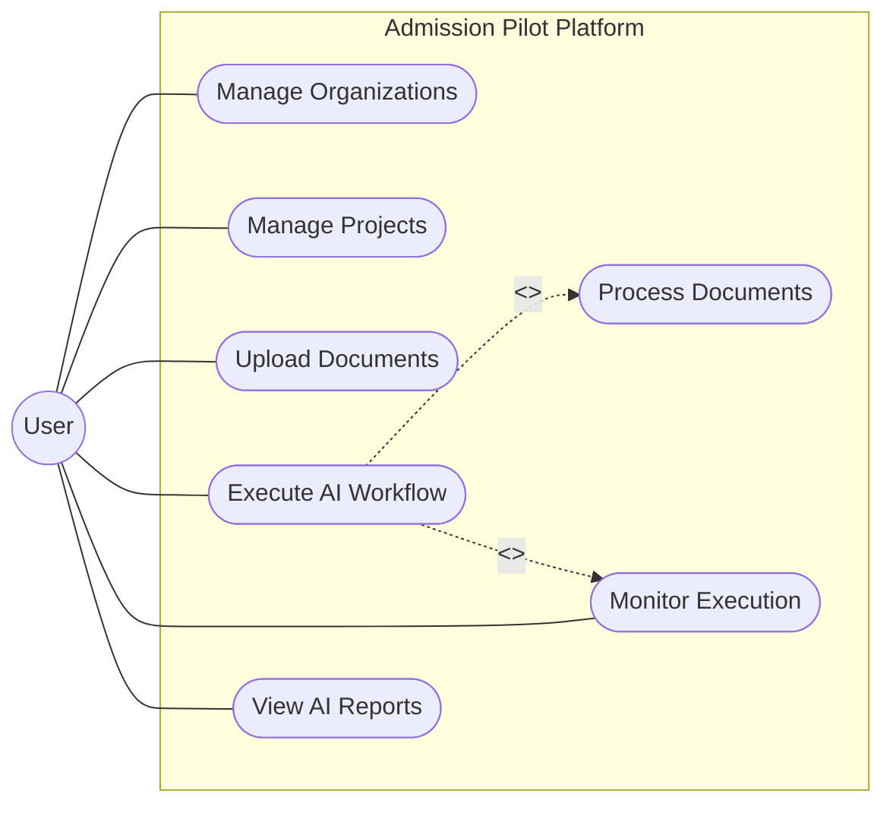

# Use Case Diagram

## 1. Diagram Name
Use Case Diagram

## 2. Purpose of the diagram
To visualize the functional requirements of the Admission Pilot system from the user's perspective, illustrating the interactions between the primary actors and the system's core functionalities.

## 3. What the diagram represents
This diagram represents the major use cases of the AI SaaS Platform, including user actions such as managing organizations/projects, uploading documents, triggering AI workflows, and viewing generated reports. It also shows the system boundaries and external interactions.

## 4. Key elements shown
*   **Actors:** User
*   **System Boundary:** Admission Pilot Platform
*   **Use Cases:** Manage Organization, Manage Projects, Upload Documents, Execute AI Workflow, Monitor Execution (WebSocket), View Intelligence Reports.
*   **Relationships:** Actor-to-Use-Case associations, `<<include>>` relationships (e.g., executing workflow includes document processing).

## 5. Brief explanation of the workflow/relationships
The User is the primary actor who interacts with the system to set up their workspace (Organizations and Projects). The user uploads documents which are then processed by the system. The core feature is triggering the "Execute AI Workflow", which seamlessly includes background AI processing. The user can monitor the status in real-time via WebSockets and finally access the generated reports.

---

### Mermaid Source

