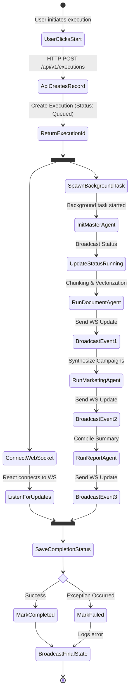

# Activity Diagram

## 1. Diagram Name
Activity Diagram - AI Agent Execution Workflow

## 2. Purpose of the diagram
To illustrate the dynamic behavior of the system by depicting the control flow from one activity to another during the core AI execution process.

## 3. What the diagram represents
This diagram represents the step-by-step end-to-end workflow that occurs when a user triggers an AI analysis execution. It spans across the frontend React UI, the FastAPI backend, and the LangGraph-based Master Agent orchestration.

## 4. Key elements shown
*   **Initial/Final Nodes:** Start and end of the workflow.
*   **Actions:** User clicks, API processing, background tasks, agent processing.
*   **Parallel Activities:** The backend starts the background AI workflow while simultaneously establishing a WebSocket connection with the frontend for real-time UI updates.
*   **Decisions/Branches:** Exception handling in case of workflow failure.

## 5. Brief explanation of the workflow/relationships
The workflow begins when the user clicks "Start Execution" on the React frontend. An HTTP POST request is sent to the backend, which immediately creates an `Execution` record (queued status) and returns the ID. Two parallel tracks then start: the UI connects to a WebSocket for live updates, while the backend spawns a background task. The background task initializes the MasterAgent, which orchestrates the Document, Marketing, and Report generation agents. As each agent finishes, WebSocket events are broadcasted. The workflow concludes when the final report is generated and the execution status is marked as completed or failed.

---

### Mermaid Source

