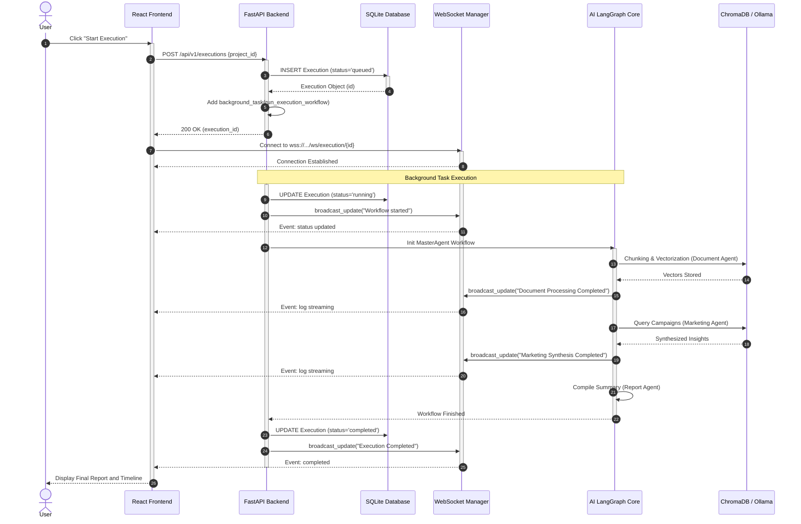

# Sequence Diagram

## 1. Diagram Name
Sequence Diagram - AI Agent Execution Flow

## 2. Purpose of the diagram
To illustrate how the different objects and components of the Admission Pilot system interact over time to accomplish the execution of the AI workflow.

## 3. What the diagram represents
This diagram shows the sequential message passing and function invocation between the User, React Frontend, FastAPI Backend, SQLite Database, WebSocket Manager, and the LangGraph AI Core (including Ollama and ChromaDB) during the execution pipeline.

## 4. Key elements shown
*   **Lifelines:** User, React UI, FastAPI Backend, SQLite Database, WebSocket Manager, AI LangGraph Core.
*   **Messages:** HTTP Requests (POST), Database Transactions (Insert/Update), Background Task Instantiation, WebSocket Broadcasts.
*   **Activations:** Indicating when a component is actively processing a request.
*   **Asynchronous Flows:** The background execution of agents decoupled from the HTTP response.

## 5. Brief explanation of the workflow/relationships
The User triggers the execution via the React UI, which sends an HTTP POST request to the FastAPI Backend. The Backend immediately creates an `Execution` record in the SQLite Database and returns the `execution_id` to the UI, freeing up the HTTP thread. The UI then connects to the WebSocket Manager using this ID. Concurrently, the Backend triggers an asynchronous background task that invokes the AI LangGraph Core. As the AI Core progresses through its internal agents (Document, Marketing, Report), it pushes status updates to the WebSocket Manager, which streams them down to the React UI in real-time. Finally, the Database is updated with the "completed" status.

---

### Mermaid Source

