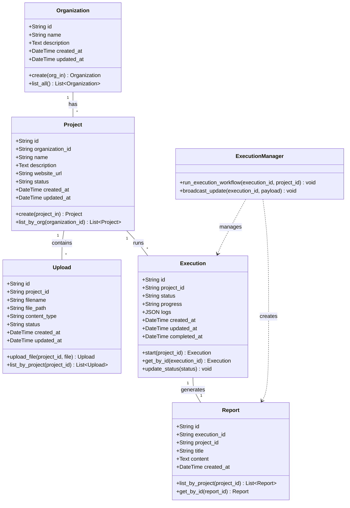

# Class Diagram

## 1. Diagram Name
Class Diagram - Domain Data Models

## 2. Purpose of the diagram
To document the static structure of the database and application domain models, illustrating the classes, their attributes, methods, and relationships.

## 3. What the diagram represents
This diagram represents the actual SQLAlchemy ORM domain models defined in the FastAPI backend (`backend/app/models/domain.py`), which maps directly to the SQLite database schema. It also logically connects the `ExecutionManager` to these entities.

## 4. Key elements shown
*   **Classes:** `Organization`, `Project`, `Upload`, `Execution`, `Report`, `ExecutionManager`.
*   **Attributes:** Relevant fields with their data types (e.g., `String`, `Text`, `DateTime`, `JSON`).
*   **Methods:** Base repository/manager logic representations.
*   **Relationships:** 
    * One-to-Many: Organization -> Project, Project -> Upload, Project -> Execution.
    * One-to-One: Execution -> Report.
    * Dependency: ExecutionManager interacts with Execution and Report.

## 5. Brief explanation of the workflow/relationships
The `Organization` serves as the root tenant for the system, which can contain multiple `Project`s. A `Project` acts as an encapsulation unit for uploaded documents (`Upload`) and AI workflow runs (`Execution`). When an `Execution` runs, it generates one final `Report`. The `ExecutionManager` is the core service class that orchestrates the status updates and creation of these entities during runtime.

---

### Mermaid Source

