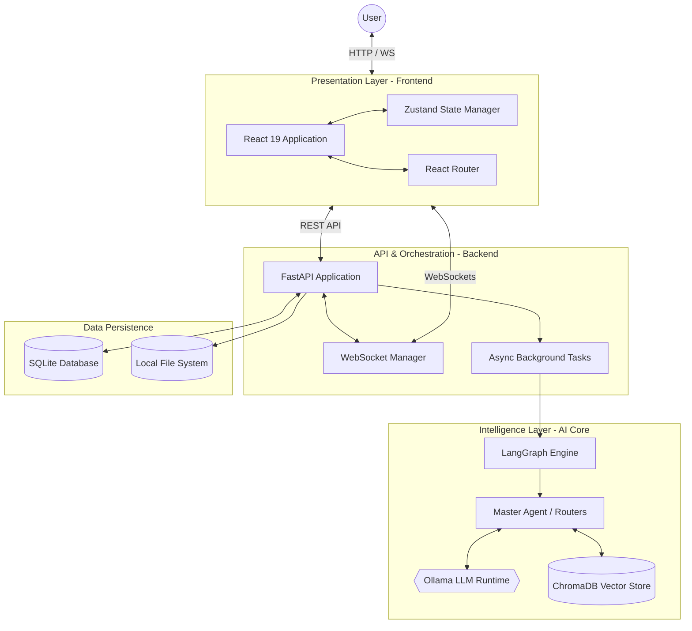

# Component Diagram

## 1. Diagram Name
Component Diagram - System Architecture

## 2. Purpose of the diagram
To visualize the high-level software architecture, showing the major physical and logical components of the Admission Pilot platform and how they interface with one another.

## 3. What the diagram represents
This diagram represents the actual modular architecture spanning the React frontend, the FastAPI backend, the AI intelligence layer, and the underlying databases. It emphasizes the separation of concerns and integration points.

## 4. Key elements shown
*   **Presentation Component:** React 19 UI, Zustand State Management, React Router.
*   **API & Orchestration Component:** FastAPI Backend, WebSocket Manager, Background Task Engine.
*   **AI Core Component:** LangGraph Agent Engine, Ollama LLM Runtime, Master Agent & specialized sub-agents.
*   **Data Persistence:** SQLite (Relational metadata), ChromaDB (Vector store), File System (Uploads).
*   **Interfaces:** RESTful HTTP, WebSockets, Local RPC (Ollama).

## 5. Brief explanation of the workflow/relationships
The client browser loads the React frontend component. The UI communicates with the FastAPI Backend via standard REST APIs for CRUD operations and WebSockets for real-time execution logs. The backend handles local file persistence and relational data in SQLite. For AI processing, the backend invokes the LangGraph Agent Engine, which in turn queries ChromaDB for contextual embeddings and relies on Ollama for local LLM inference. All components run cleanly decoupled yet tightly integrated.

---

### Mermaid Source

