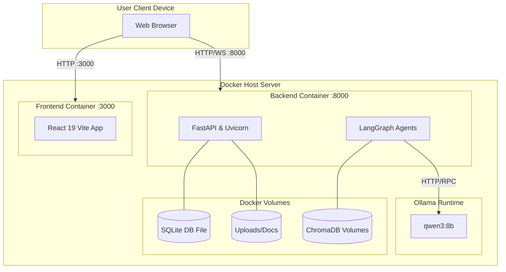

# Deployment Diagram

## 1. Diagram Name
Deployment Diagram - Docker Infrastructure

## 2. Purpose of the diagram
To illustrate the physical deployment architecture of the Admission Pilot project, showing how software components are mapped onto hardware/infrastructure nodes.

## 3. What the diagram represents
This diagram represents the actual Docker-based deployment configuration based on the `docker-compose.yml` environment. It outlines the nodes (containers), their exposed ports, and the communication protocols between the user's local machine and the containerized services.

## 4. Key elements shown
*   **Nodes:** User Device, Docker Host (Server).
*   **Execution Environments:** Frontend Container (Node/Nginx), Backend Container (Python/Uvicorn), AI Services.
*   **Artifacts:** React Build, FastAPI Application, SQLite Database file, ChromaDB.
*   **Communication:** HTTP/HTTPS over TCP/IP, WebSocket (ws://), internal Docker network communication.

## 5. Brief explanation of the workflow/relationships
The deployment is managed via Docker Compose on a single Docker Host. The User accesses the Frontend Application via their web browser on port 3000. The Frontend container communicates with the Backend API container via port 8000. The Backend container mounts a volume for the SQLite database and uploaded files. The Backend also communicates locally with the ChromaDB vector store and the Ollama LLM runtime, all operating securely within the internal Docker bridge network.

---

### Mermaid Source

