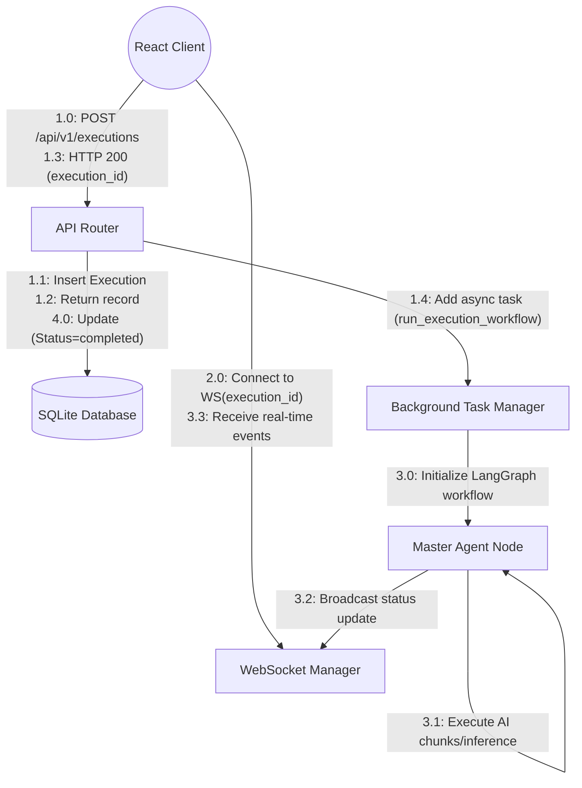

# Communication Diagram

## 1. Diagram Name
Communication Diagram - Agent Execution Workflow

## 2. Purpose of the diagram
To show the structural organization of objects/components that send and receive messages during the AI Agent Execution Workflow, emphasizing the links between them rather than just the timeline.

## 3. What the diagram represents
This diagram represents the same core interaction as the Sequence Diagram (triggering an AI execution) but visualizes the structural relationships and the ordered message flow (using numbered interactions) between the React Frontend, API Router, Execution Manager, Database, and WebSocket Manager.

## 4. Key elements shown
*   **Objects/Components:** React Client, API Router, Database Session, Background Task Manager, Master Agent, WebSocket Manager.
*   **Links:** The communication paths between these components.
*   **Numbered Messages:** 1.0, 1.1, 1.2, etc., dictating the chronological order of operations across the structural links.

## 5. Brief explanation of the workflow/relationships
The communication starts from the Client (1.0) pushing a POST request to the API. The API communicates with the Database (1.1, 1.2) to create the execution record and returns the response (1.3). The client then establishes a WebSocket connection (2.0). Meanwhile, the API triggers the Background Task Manager (1.4), which initializes the Master Agent (3.0). The Master Agent interacts with its tools/LLMs (3.1) and pushes updates to the WebSocket Manager (3.2), which streams them to the Client (3.3). Finally, the Database is updated with the final status (4.0).

---

### Mermaid Source

