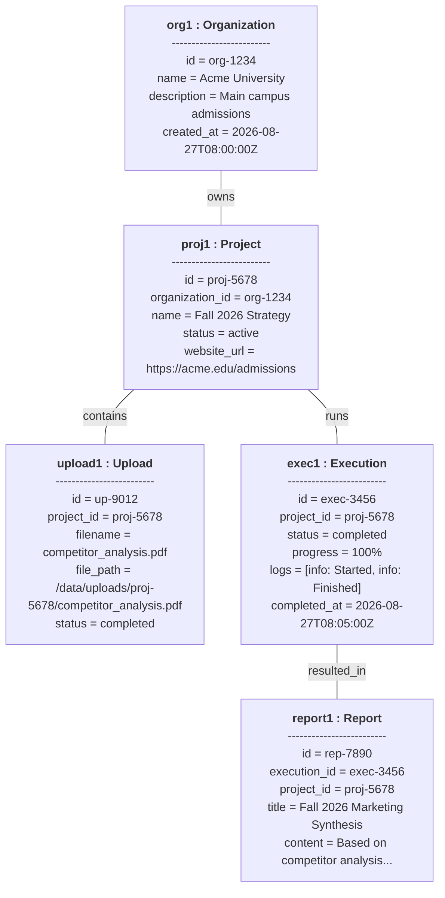

# Object Diagram

## 1. Diagram Name
Object Diagram - Database Runtime Snapshot

## 2. Purpose of the diagram
To provide a concrete, realistic snapshot of the system's objects at a specific moment in time (e.g., just after an AI workflow has successfully completed).

## 3. What the diagram represents
This diagram instantiates the structural classes from the Class Diagram into actual runtime objects. It shows a sample Organization with one Project, which contains one Uploaded Document, one corresponding Execution run, and the resulting AI Report.

## 4. Key elements shown
*   **Objects:** Instantiated class entities in the format `objectName: ClassName`.
*   **Attributes & Values:** Concrete data assigned to object attributes (e.g., status="completed").
*   **Links:** Instance-level relationships representing how the objects are connected via Foreign Keys in the database.

## 5. Brief explanation of the workflow/relationships
In this snapshot, `org1` (Acme Corp) has a project `proj1` (Q3 Admissions Strategy). A document `upload1` (q3_data.pdf) has been uploaded into this project. The system processed an execution run `exec1` for this project which is now in a "completed" state. As a result of this execution, the AI system generated a report `report1` containing the final summarized insights. This clearly maps the abstract classes to a real-world data scenario within the Admission Pilot platform.

---

### Mermaid Source

