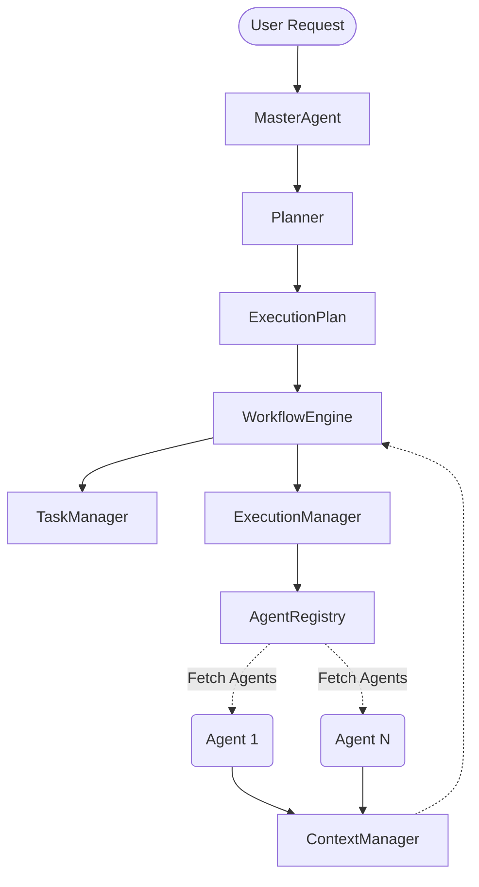

# Agent Architecture

AdmissionPilot uses a highly modular, event-driven, multi-agent architecture. This allows individual components to scale independently and ensures the system remains extensible for future Agent capabilities.

## High-Level Architecture

The AI core infrastructure orchestrates goal decomposition, agent assignment, and execution tracking.

## Execution Flow
1. **Initialization**: The `MasterAgent` receives a goal and constructs the initial `Context`.
2. **Planning**: The `MasterAgent` calls the `Planner`, which decomposes the goal into tasks and identifies required `Capabilities` (e.g., RESEARCH, WRITING). The `AgentRegistry` helps identify available agents for these capabilities.
3. **Execution Routing**: The resulting `ExecutionPlan` is sent to the `WorkflowEngine` and `ExecutionManager`.
4. **Task Execution**: 
   - The `WorkflowEngine` registers all tasks via `TaskManager`.
   - The `ExecutionManager` iteratively processes tasks that have their dependencies met.
   - Tasks are dispatched to matched `BaseAgent` instances.
5. **Context Management**: All agent outputs update the immutable `Context` via `ContextManager`.
6. **Completion**: Once all tasks hit a `COMPLETED` state, the `MasterAgent` synthesizes a final response.

## Event System
The system is entirely decoupled using an `EventDispatcher`. Lifecycle hooks such as `TaskCreated`, `TaskCompleted`, and `WorkflowStarted` are emitted, allowing for audit logging or distributed message brokering (e.g., Kafka) in the future.

## LangGraph Integration
While the `WorkflowEngine` orchestrates tasks at the application level, LangGraph is integrated at the macro level (MasterAgent state routing) using a `StateGraph`, moving execution from `Planner` -> `ExecutionManager` -> `Review` -> `Final Response`.
