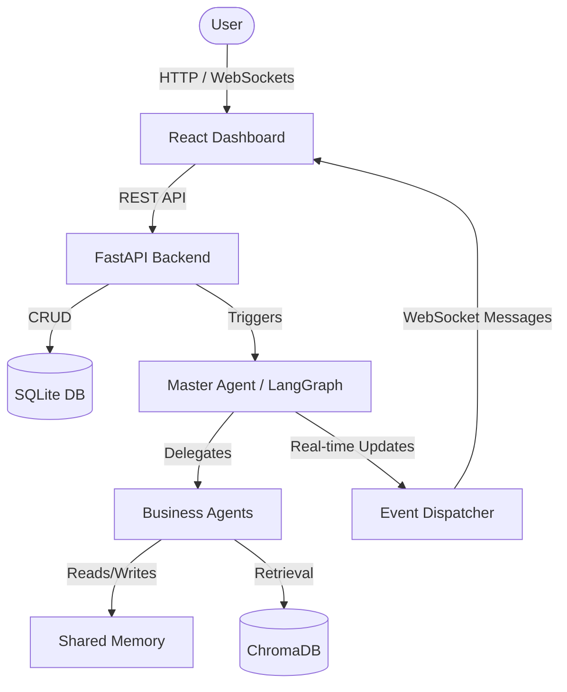
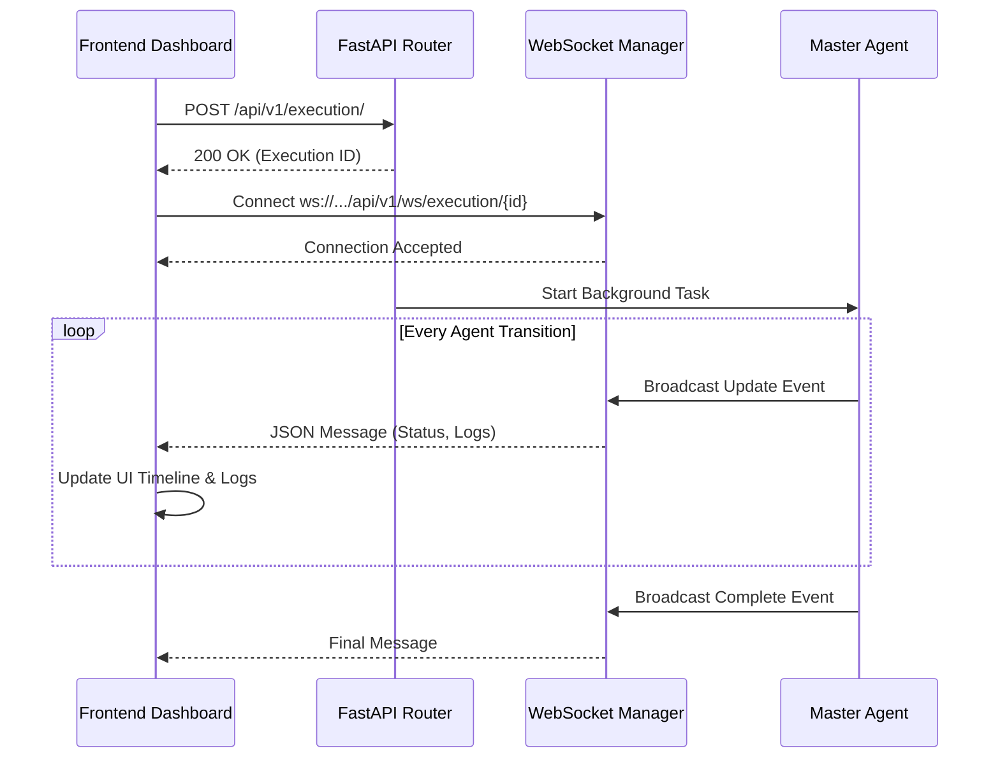

# AdmissionPilot Phase 6 Integration

## 1. System Flow Overview

AdmissionPilot integrates a React frontend, a FastAPI backend, an SQLite/SQLAlchemy database, and an autonomous LangGraph agent network.

## 2. API Flow

- **POST `/api/v1/organizations/`**: Create new client organization.
- **POST `/api/v1/projects/`**: Create a new admission drive project.
- **POST `/api/v1/uploads/`**: Upload PDFs, DOCX, CSV. Stores files in local directory and metadata in DB.
- **POST `/api/v1/execution/`**: Triggers the `MasterAgent` in a FastAPI `BackgroundTask`. Returns Execution ID immediately.
- **GET `/api/v1/reports/`**: Retrieve generated markdown reports for a project.

## 3. WebSocket Real-Time Flow

When the LangGraph workflow is running in the background, it continuously dispatches events to the WebSocket Manager.

## 4. Execution Flow details
The uploaded documents are **NOT** processed during the HTTP request to prevent timeouts. Instead, the first step of the LangGraph execution is the Document Intelligence Agent taking the raw files, chunking them, and inserting them into ChromaDB.
