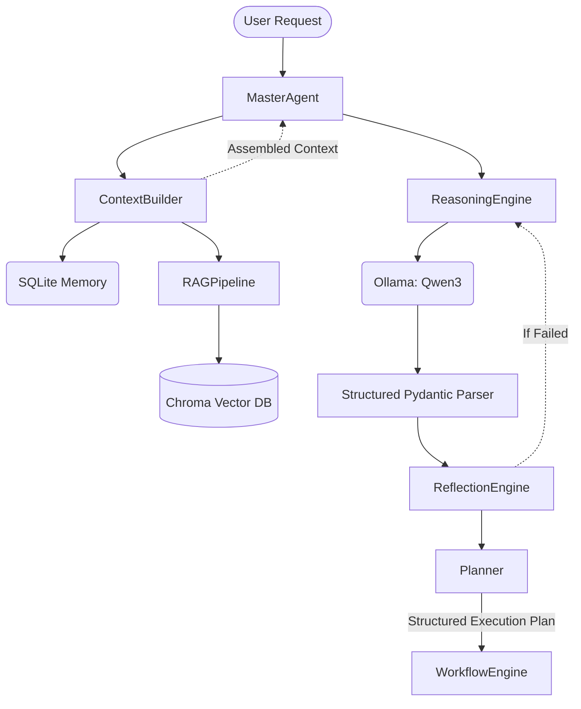

# LLM Architecture

AdmissionPilot uses a robust, local-first LLM intelligence layer to drive agent behavior, memory persistence, and dynamic planning.

## High-Level Pipeline

## Core Components

### 1. Local LLM Layer
Powered by Ollama and integrated via `LangChain`. We wrap this into a `LocalLLM` class that manages streaming, generic invocation, and structured parsing via `PydanticOutputParser`. The `ModelManager` seamlessly allows hot-swapping models (e.g., Llama3, Mistral, Qwen3).

### 2. Memory Ecosystem
Memory is split into three scopes:
- **Conversation Memory**: Short-term interactions stored in SQLite.
- **Workspace Memory**: Variable context available to execution flows, stored in SQLite.
- **Company Knowledge**: A full RAG pipeline mapping `.txt`, `.pdf`, etc. into embeddings (Sentence-Transformers) and stored locally in ChromaDB.

### 3. Intelligence Engines
- **Reasoning Engine**: Ingests requests and extracts missing context, required capabilities, and execution strategies.
- **Reflection Engine**: A self-correction layer that verifies the structured outputs for consistency and hallucination detection before committing to an action.
- **Planner**: Re-architected to use the LLM to generate `StructuredExecutionPlan` models, which translate dynamically into executable task arrays.

### 4. Parsers and Prompts
- Raw JSON parsing is forbidden. All complex LLM returns use Pydantic models in `backend/app/parsers/structured.py`.
- Prompts are strictly modularized and retrieved dynamically via `PromptManager`.
